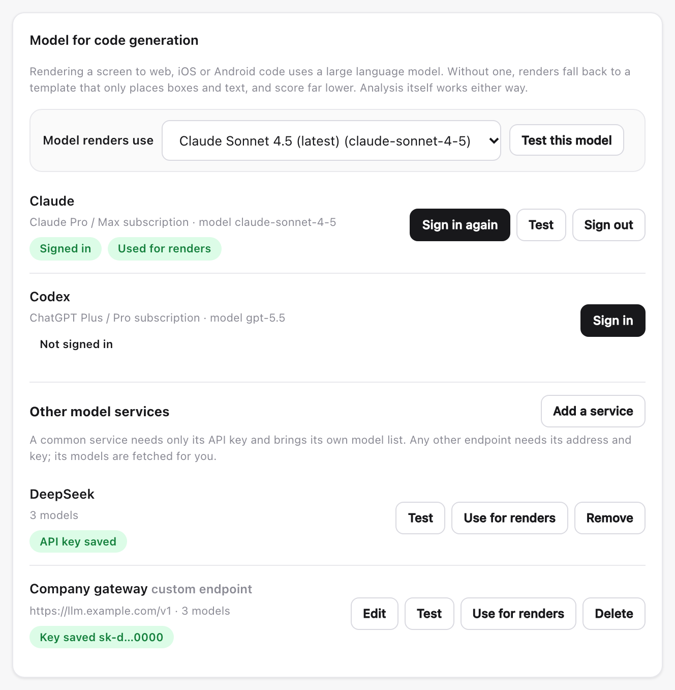

# dsh-figma-design-lens-cat

Figma design understanding for AI coding agents.

It reads a Figma screen and produces the information an implementation needs:
every element's true geometry, its colours and type, the artwork that cannot
be rebuilt from data, and the arrangement the designer set up. It then renders
what a model generated from that information on web, iOS and Android, and
scores it against Figma's own render of the same screen -- so the quality of
the extraction is measured rather than assumed.


## What it is for

A model given a list of Figma nodes writes plausible code that does not match
the design. The gap is rarely the model: it is what the node list leaves out.
The REST API returns no width or height on any node, omits every property left
at its default, and describes a rotated shape by the box around it rather than
the shape itself.

This tool closes that gap, and proves it did by rendering the result.

## Install

```bash
npm install -g dsh-figma-design-lens-cat
```

Or from source, for local development -- the global command then runs this checkout:

```bash
git clone https://github.com/tianxia--/dsh-figma-design-lens-cat.git
cd dsh-figma-design-lens-cat
npm install
npm link

# Confirm which checkout the global command points at
npm ls -g dsh-figma-design-lens-cat
```

`npm link` points the global command at the checkout. If the checkout is moved or deleted, the command stops working until `npm link` is run again from its new location.

## First-time setup

Run the guided setup after installing. It walks through two things:

```bash
dsh-figma-design-lens-cat setup
```

1. **A Figma token** (required) -- `inspect` and `add` cannot read a design without one.
2. **A model for code generation** (optional, strongly recommended) -- rendering a screen to web, iOS or Android code uses a large language model. Without one, renders fall back to a template that only places boxes and text, and score far lower. Analysis itself (`add`, `inspect`, the MCP tools) works either way.

### Figma token

Create the token in Figma: **Account settings → Personal access tokens**. Do not paste the token into chat or commit it. Save it locally with either command:

```bash
dsh-figma-design-lens-cat token <your-figma-token>
# or
dsh-figma-design-lens-cat config --token <your-figma-token>
```

### Model

Rendering a screen to code uses a large language model; analysis does not.
Connect one in any of four ways, then switch between every model of every
connected service:

- **Subscription sign-in** -- Claude Pro / Max or ChatGPT Plus / Pro (Codex),
  through the browser.
- **A common service, by API key** -- about thirty ship with their own model
  lists: DeepSeek, Kimi, Qwen, Z.AI, MiniMax, OpenAI, Gemini, OpenRouter and more.
- **Any other endpoint** -- a company gateway or a local Ollama: its address
  and key; its models are fetched.
- **By hand** -- when an endpoint cannot list its models.

All of it is in the review UI under **Settings → Model for code generation**:



Or from the CLI:

```bash
dsh-figma-design-lens-cat llm login anthropic           # sign in to a subscription
dsh-figma-design-lens-cat llm login deepseek            # a common service; asks for its key
dsh-figma-design-lens-cat llm provider add gateway \
  --base-url https://gateway.example.com/v1 --api-key-env GATEWAY_API_KEY   # models fetched
dsh-figma-design-lens-cat llm models                    # every model, grouped by service
dsh-figma-design-lens-cat llm use deepseek/deepseek-v4-pro
```

**[The model setup guide](docs/model-services.md)** ([中文](docs/model-services.zh.md))
walks through each way with screenshots, and covers keys, privacy and
troubleshooting.

### Verify

```bash
dsh-figma-design-lens-cat doctor       # token, package and model
dsh-figma-design-lens-cat llm status   # which model renders use, and whether its login still works
```

The same check is on the review UI's Settings page, under **Environment check**.

## Use

```bash
# What a Figma link actually holds -- a screen, or a canvas of many
dsh-figma-design-lens-cat inspect '<figma link>'

# Analyse one screen (alias: analyze)
dsh-figma-design-lens-cat add '<figma link>'
dsh-figma-design-lens-cat add '<figma link>' --project <label> --detectors

# Open the local review UI (default port 7420)
dsh-figma-design-lens-cat serve
dsh-figma-design-lens-cat serve --port 7421

# What has been analysed
dsh-figma-design-lens-cat list
dsh-figma-design-lens-cat projects
dsh-figma-design-lens-cat screens <project>
```

Everything stays on the machine it runs on. Nothing is uploaded.


## What it extracts

| | |
|---|---|
| **Geometry** | True width, height and origin, recovered from the bounding box by inverting the rotation. Verified to 0.0000pt against known rectangles. |
| **Colour** | Fills including blended layers: a second fill set to COLOR_DODGE lightens what is under it, and taking only the first loses that. |
| **Type** | Family, size, weight, alignment, and the size at which a string fits its measured box in a fallback font. |
| **Artwork** | Vectors, boolean operations and photos exported as images, because their outlines are not in the data at any size. |
| **Effects** | Shadows and blurs, with a background blur kept apart from a layer blur: they are different APIs and confusing them smears the content. |
| **Layout** | The direction, gap, padding and alignment a designer set up -- as intent. Coordinates remain the source of truth. |
| **Clipping** | Whether a node cuts off what overflows it. |

## How the result is checked

Generation is verified rather than trusted. Every emitted element carries its
node id -- `data-id` on web, `accessibilityIdentifier` on SwiftUI,
`testTag` on Compose -- and the output is compared against the list it was
given. Anything missing is sent back in a second pass that adds only the gap,
up to three rounds, keeping whatever was already correct.

Failures are never silent. A build that does not compile, an expired login, an
analysis older than the pipeline -- each says so instead of leaving a previous
result in place.

## Fidelity

Two screens of a file the tool had not seen, rendered from the extraction and
scored against Figma's own render. Left to right: the design, then web, iOS
and Compose.


| screen | web | iOS | Compose |
|---|---|---|---|
| scene list | 85.5 | 81.5 | 79.6 |
| lesson detail | 85.3 | 74.6 | 79.5 |

Photography, rounded cards, status pills and CJK text all come through. What
remains is dominated by fonts: a commercial family that is not installed
cannot be obtained through the API, and text set in a substitute has different
metrics however exactly it is positioned.

## Agent workflow

When an agent is asked to implement, rebuild, reproduce or review UI from a `figma.com` link, this package should be the first design-understanding step:

```bash
# MCP equivalent: analyze_design
# CLI equivalent:
dsh-figma-design-lens-cat add '<figma link>'
```

Then read the implementation spec instead of starting from raw Figma REST nodes:

```bash
# MCP: get_implementation_spec, then get_components/get_assets as needed
dsh-figma-design-lens-cat screens <project>
```

See [Agent Figma implementation workflow](docs/agent-figma-implementation.md) for the mandatory agent order, fallback rules, and what still belongs to downstream device or icon-conversion tools.

## MCP server

```bash
# See which clients are on this machine
dsh-figma-design-lens-cat install

# Wire it into one, or all of them
dsh-figma-design-lens-cat install claude
dsh-figma-design-lens-cat install workbuddy
dsh-figma-design-lens-cat install all
```

Claude Code, Claude Desktop, Cursor, Codex and WorkBuddy are written directly; the rest
of each config is left as it was, and a file that does not parse is reported
rather than replaced. Restart the client afterwards -- for a desktop app, quit
it with Cmd+Q; closing the window is not enough.

Claude Code and Codex start from a terminal, so they get the command name and
find it on the shell's PATH. Claude Desktop, Cursor and WorkBuddy get absolute paths to
node and to the server script instead: a desktop app's PATH is not the
shell's, and may not contain npm's global bin directory or node itself. After
changing Node versions or reinstalling the package somewhere else, run
`install` again -- `doctor` and the Settings page report an entry whose path
has gone stale.

WorkBuddy has its own steps -- see [WorkBuddy](#workbuddy) below.

On macOS, a desktop app cannot read files in your Desktop, Documents or
Downloads folders until it is granted access. A package installed from npm
lives outside them. A checkout linked from one of them with `npm link` fails
in Claude Desktop with `EPERM: operation not permitted` until Claude is allowed
in System Settings → Privacy & Security → Files and Folders.

By hand, if you prefer:

```bash
# Prints the exact entry for this machine, with absolute paths
dsh-figma-design-lens-cat install-mcp --client json
```

```json
{
  "mcpServers": {
    "dsh-figma-design-lens-cat": {
      "command": "/absolute/path/to/node",
      "args": ["/absolute/path/to/dsh-figma-design-lens-cat/bin/mcp.mjs"]
    }
  }
}
```

Eight tools: `analyze_design`, `list_projects`, `list_screens`,
`get_screen`, `get_implementation_spec`, `get_components`, `get_assets`,
`open_review`.

Everything the MCP server does is also a command, so an agent without MCP can
call the CLI instead:

```bash
dsh-figma-design-lens-cat add '<figma link>'   # analyse a screen
dsh-figma-design-lens-cat projects             # what has been analysed
dsh-figma-design-lens-cat screens <project>    # the screens in one
```

To print the config entry instead of writing it -- for a client `install` does not know:

```bash
dsh-figma-design-lens-cat install-mcp --client claude   # a `claude mcp add` command
dsh-figma-design-lens-cat install-mcp --client codex    # a ~/.codex/config.toml block
dsh-figma-design-lens-cat install-mcp --client json     # JSON for Claude Desktop, Cursor, WorkBuddy, Windsurf
```

### WorkBuddy

Two ways to add the server to Tencent WorkBuddy. Both need the package
installed and set up first:

```bash
npm install -g dsh-figma-design-lens-cat
dsh-figma-design-lens-cat setup     # Figma token, and optionally a model
```

**1. With the CLI** (1.2.0 and later)

```bash
dsh-figma-design-lens-cat install workbuddy
dsh-figma-design-lens-cat doctor    # expect: mcp workbuddy  configured
```

WorkBuddy keeps its servers in `mcp.json` inside its data folder, and that
folder depends on the edition: the WorkBuddy AI desktop app uses
`~/.workbuddy-ai/mcp.json`, while WorkBuddy's docs describe
`~/.workbuddy/mcp.json`. An entry in the wrong one is silently ignored.
`install workbuddy` writes to `~/.workbuddy-ai` when it exists and to
`~/.workbuddy` otherwise; set `WORKBUDDY_DATA_FOLDER_NAME` to choose another.

**2. From WorkBuddy's own settings** (any version)

WorkBuddy decides where to save, so this works whatever its data folder is
called.

1. Print the entry for this machine. It holds absolute paths to node and to
   the server script, so it has to be generated on the machine that uses it:

   ```bash
   dsh-figma-design-lens-cat install-mcp --client json
   ```

2. In WorkBuddy, open **Plugins → MCP servers → Configure MCP**
   (插件 → MCP 服务器 → 配置 MCP).
3. Add the `dsh-figma-design-lens-cat` entry under `mcpServers` and save.

**Then, either way**

- With the CLI, quit WorkBuddy with Cmd+Q and reopen it: it does not pick up
  an `mcp.json` edited from outside while it is running. Saving from its own
  settings applies straight away; restart only if the server does not appear.
- Under **Plugins → MCP servers** (插件 → MCP 服务器), turn
  `dsh-figma-design-lens-cat` on -- a newly added server can start switched
  off -- and check that it shows green.
- Paste a Figma link and ask for the screen, e.g. "implement this screen",
  followed by the link. If the agent replies that it will use the CLI
  instead, the server is not loaded: check the switch, then `doctor`.

## Background service (macOS)

Run the review UI in the background and start it at login, instead of keeping `serve` open in a terminal:

```bash
dsh-figma-design-lens-cat service install     # install and start now, and at every login
dsh-figma-design-lens-cat service status      # installed? loaded? listening?
dsh-figma-design-lens-cat service stop        # stop now (it returns at next login)
dsh-figma-design-lens-cat service start       # start it again
dsh-figma-design-lens-cat service restart     # pick up a code change
dsh-figma-design-lens-cat service logs        # last 40 log lines
dsh-figma-design-lens-cat service uninstall   # remove it completely
```

The service records the absolute path of the checkout it was installed from. After moving the checkout, run `service uninstall` and then `service install` again.

## Commands

Short alias for every command: `dlc`.

**Setup**

| | |
|---|---|
| `setup` | First-time guide: checks the Figma token and prints the next steps |
| `token <figma-token>` | Store the Figma token |
| `config --token <figma-token>` | Store the Figma token (same as `token`) |
| `config --detectors true\|false` | Turn the image-detector cross-check on or off by default |
| `config --llm-provider <provider>` | Choose which signed-in provider renders use |
| `config --llm-model <model>` | Override the model for that provider |
| `config` | Show the current settings, with the token redacted |
| `doctor` | Check Node, Python, Pillow/NumPy, the Figma token and the store |
| `env [capability]` | Check each capability (core, vision, web/iOS/Android render) and print a fix for what is missing |
| `env --setup-android` | Install the Gradle wrapper and proxy trust store for Android rendering |
| `env --trust-proxy` | Trust a TLS-inspecting corporate proxy for the Android build |

**Analysis**

| | |
|---|---|
| `inspect <link>` | What a node holds, before analysing it |
| `add <link> [--project <label>] [--detectors]` | Analyse one screen (alias: `analyze`) |
| `list` | Projects with screen counts and readiness |
| `projects` | Project identities, file keys and aliases |
| `screens <project>` | The screens in one project |
| `stale` | Which stored analyses predate the current pipeline |
| `reindex` | Rebuild the project index from the store |

**Review UI and service**

| | |
|---|---|
| `serve [--port 7420]` | Local review UI |
| `service install\|status\|stop\|start\|restart\|logs\|uninstall` | Run the review UI in the background (macOS) |

**Agents**

| | |
|---|---|
| `install` | List the MCP clients found on this machine |
| `install <client>` / `install all` | Wire the MCP server into `claude`, `claude-desktop`, `cursor`, `codex`, `workbuddy`, or all found |
| `install-mcp [--client claude\|codex\|json]` | Print the config entry instead of writing it |

**Code generation and benchmarks**

| | |
|---|---|
| `llm login [provider]` | Connect a model service: a subscription (`anthropic`, `openai-codex`, `github-copilot`) signs in through the browser; any other service in `llm services` asks for its API key. Default `anthropic` |
| `llm logout [provider]` | Sign out of a subscription, or forget a service's API key |
| `llm services` | Services that need only an API key, with how many models each has |
| `llm status [--offline]` | Which providers work, including custom ones, which one renders use, and whether each login still works |
| `llm models` | Every model renders can use, grouped by provider |
| `llm use <provider>/<model>` | Choose the model renders use (`llm use <provider>` keeps that provider's model) |
| `llm test [provider] [model]` | One request to a provider, with a given model or the one in use |
| `llm provider add <id> --base-url <url> [...]` | Add or update any other endpoint; its models are fetched unless named with `--model` (see the [model setup guide](docs/model-services.md#3-any-other-endpoint-address-and-key)) |
| `llm provider list` / `llm provider remove <id>` | List custom providers, with keys masked / remove one |
| `bench init <figma link> [--size 12]` | Pick a fixed set of screens to benchmark |
| `bench score --project <id> [--label <name>]` | Score the set and record the run |
| `bench history` | Every recorded run |
| `bench compare` | The last two runs, like for like |
| `bench show` | The screens in the set |

## Troubleshooting

**`command not found: dsh-figma-design-lens-cat`** -- the global link points at a checkout that was moved or deleted. Run `npm link` again from the checkout you want to use, then check with `npm ls -g dsh-figma-design-lens-cat`.

**`no Figma token configured`** -- run `dsh-figma-design-lens-cat setup` and follow the steps, then `dsh-figma-design-lens-cat doctor`.

**`listen EADDRINUSE: address already in use :::7420`** -- something already serves port 7420, usually the background service:

```bash
# What holds the port
lsof -nP -iTCP:7420 -sTCP:LISTEN

# If it is the background service, use it instead of `serve` -- or stop it
dsh-figma-design-lens-cat service status
dsh-figma-design-lens-cat service stop

# Or run on another port
dsh-figma-design-lens-cat serve --port 7421
```

**A background service from before the rename** -- versions named `design-lens-cat` installed a service under a different label, which `service uninstall` does not remove. It keeps serving the old code, even after that checkout is deleted. Remove it by hand:

```bash
launchctl bootout gui/$(id -u)/com.design-lens-cat.server
rm ~/Library/LaunchAgents/com.design-lens-cat.server.plist
```

**Renders look far worse than the design** -- check whether a model drew them. The review UI says "Rendered with the template, not a model" with the reason, and `render/<platform>/<screen>/meta.json` in the store records `"generator": "template"` and `fellBackBecause`. The usual causes are that no model is signed in, or that the optional package is missing -- often after moving or reinstalling the checkout, because it lives in that checkout's `node_modules`. Fix it in **Settings → Model for code generation**, or run `dsh-figma-design-lens-cat setup`, then render again. If renders still use the template after installing the package from a terminal, restart `serve`.

**A screen scores far lower than expected** -- it may have been analysed by an older pipeline. `dsh-figma-design-lens-cat stale` lists those; re-analyse them with `add`.

## Requirements

- Node 20 or newer
- Python 3 with Pillow and NumPy, for image comparison
- Chrome, for web rendering
- Xcode command line tools, for iOS rendering (macOS only)
- A JDK, for Compose rendering

Each is optional: a missing one disables its own target and nothing else.

## Licence

MIT
