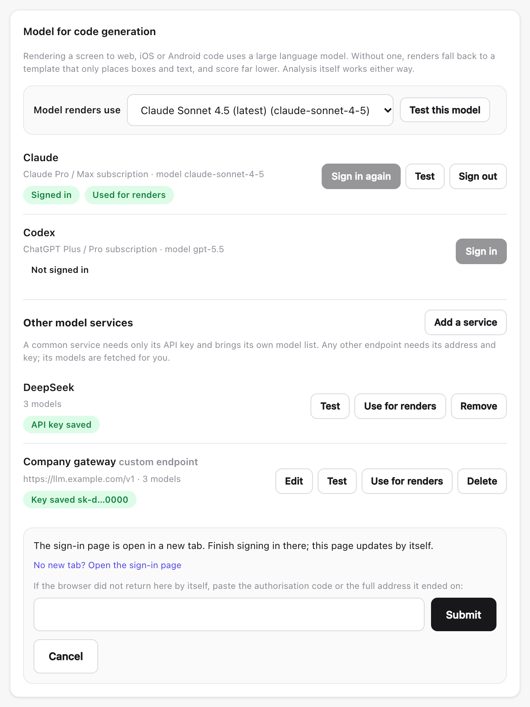
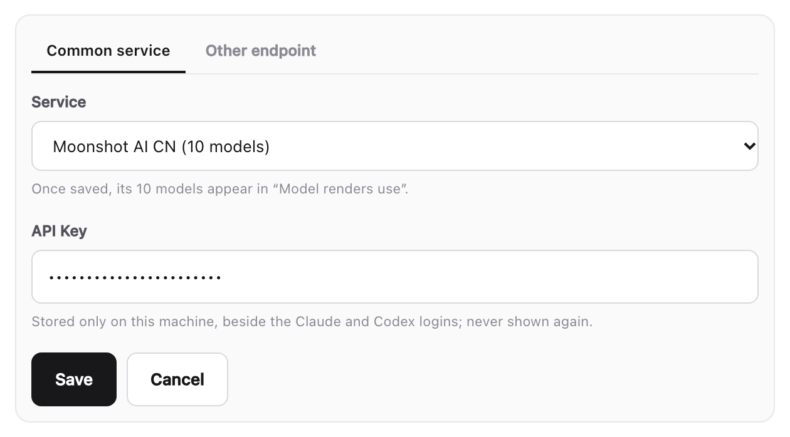
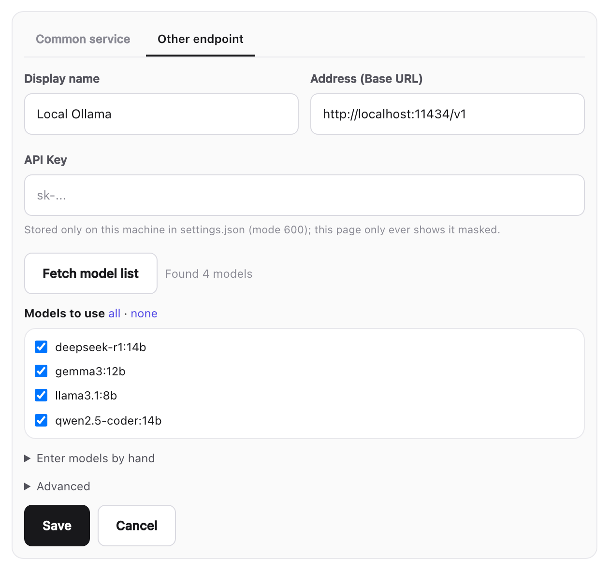
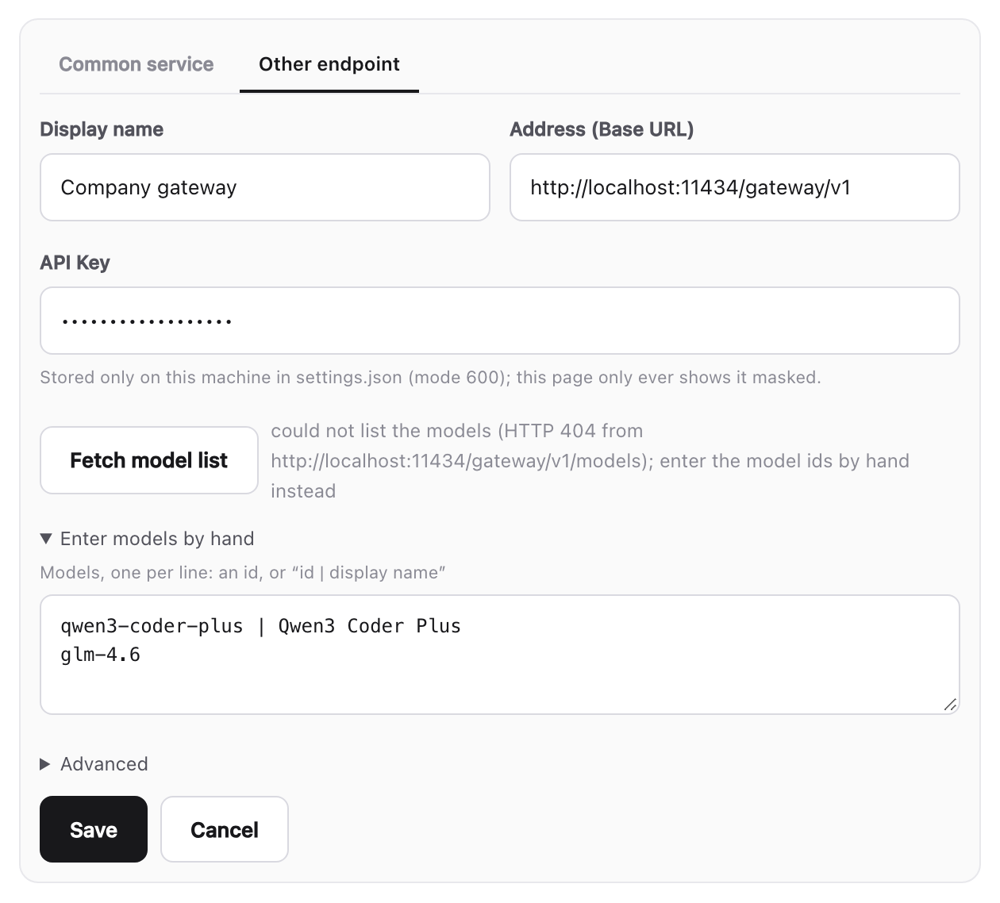

# Choosing the model renders use

English | [中文](model-services.zh.md)

Analysing a Figma screen works without any model. **Rendering** a screen to
web, iOS or Android code does not: it asks a large language model to write the
code. With no model connected, renders fall back to a template that only places
boxes and text, and score far lower.

You can connect a model in any of four ways, and switch between every model of
every connected service at any time:

| Way in | What you need | Models you get |
|---|---|---|
| [Subscription sign-in](#1-sign-in-with-a-subscription) | A Claude Pro/Max or ChatGPT Plus/Pro account | The whole Claude or Codex catalog |
| [Common service](#2-a-common-service-only-its-api-key) | Only its API key | That service's own model list |
| [Other endpoint](#3-any-other-endpoint-address-and-key) | Its address and key | Fetched from the endpoint |
| [By hand](#4-by-hand-when-the-list-cannot-be-fetched) | Its address, key and model ids | The ids you type |

Everything here lives in the review UI under **Settings → Model for code
generation** (`dsh-figma-design-lens-cat serve`, then
<http://127.0.0.1:7420/settings>). Each step also has a CLI command.


From top to bottom: the model renders use, the two subscriptions, and the
other services you added -- here DeepSeek with its API key, and a company
gateway.

---

## 1. Sign in with a subscription

For Claude (Claude Pro / Max) or Codex (ChatGPT Plus / Pro):

1. Press **Sign in** next to Claude or Codex.
2. The provider's sign-in page opens in a new tab. Approve it there.
3. The browser returns to this machine by itself and the card updates to
   **Signed in · Used for renders**.



If no tab opened, use **No new tab? Open the sign-in page**. If the browser
could not return here by itself -- signing in from another machine, say --
paste the code or the full address it ended on into the box and press
**Submit**. **Cancel** stops the sign-in at any point.

```bash
dsh-figma-design-lens-cat llm login anthropic      # or openai-codex
```

## 2. A common service: only its API key

About thirty services ship with their own model lists: DeepSeek, Kimi
(Moonshot), Qwen, Z.AI (GLM), MiniMax, OpenAI, Gemini, OpenRouter, xAI, Groq,
Mistral and more.

1. **Other model services → Add a service**. The form opens on **Common
   service**.
2. Choose the service. The line below says how many models it brings.
3. Paste its API key and **Save**.



The service becomes the one renders use, starting on its first stable model.
Pick any other of its models in **Model renders use** at the top.

```bash
dsh-figma-design-lens-cat llm services            # every such service, with its model count
dsh-figma-design-lens-cat llm login deepseek      # asks for the key; typing is not shown
```

The key is stored only on this machine, beside the subscription logins, and is
never shown again.

## 3. Any other endpoint: address and key

A company gateway, a self-hosted model, a local Ollama or LM Studio -- anything
that lists its models at `<address>/models`, as OpenAI-compatible servers do.

1. **Add a service → Other endpoint**.
2. Fill in a display name, the address (usually ending in `/v1`) and the API
   key. A local server usually needs no key.
3. Press **Fetch model list**. Every model the endpoint serves appears, all
   ticked.
4. Untick what you do not want, and **Save**.



The id is generated from the name or the address. **Advanced** holds the rest,
which rarely needs changing: the protocol (`openai-completions` by default;
also `openai-responses` and `anthropic-messages`), the id, and an environment
variable to read the key from instead of saving it.

```bash
dsh-figma-design-lens-cat llm provider add gateway --name "Company gateway" \
  --base-url https://gateway.example.com/v1 --api-key-env GATEWAY_API_KEY
# -> found 12 models at https://gateway.example.com/v1/models
```

## 4. By hand: when the list cannot be fetched

Some endpoints do not list their models. **Fetch model list** then says why,
and **Enter models by hand** opens by itself. Write one model per line: its
id, or `id | display name`.



```bash
dsh-figma-design-lens-cat llm provider add gateway --base-url https://gateway.example.com/v1 \
  --api-key-env GATEWAY_API_KEY --model qwen3-coder-plus="Qwen3 Coder Plus" --model glm-4.6
```

---

## Switching models

**Model renders use**, at the top of the card, lists every model of every
connected service, grouped by service. Choosing one switches straight away;
**Test this model** sends it one short request. A subscription that is not
signed in shows how many models signing in would add.

```bash
dsh-figma-design-lens-cat llm models                          # all models, grouped; * marks the one in use
dsh-figma-design-lens-cat llm use deepseek/deepseek-v4-pro    # switch
dsh-figma-design-lens-cat llm test                            # one request to the model in use
```

## Managing services

Each added service has its own buttons:

| Button | What it does |
|---|---|
| **Test** | One request to the service |
| **Use for renders** | Make it the service renders use, on the model chosen for it before |
| **Edit** (endpoints) | Change the address, key or models; leave the key empty to keep it |
| **Remove** / **Delete** | Forget the service and its saved key |

```bash
dsh-figma-design-lens-cat llm status                 # which services work, and which one renders use
dsh-figma-design-lens-cat llm logout deepseek        # forget a service's key, or sign out of a subscription
dsh-figma-design-lens-cat llm provider list          # endpoints added, keys masked
dsh-figma-design-lens-cat llm provider remove gateway
```

## Keys and privacy

- Keys stay on this machine: subscription logins and common-service keys in
  `~/.dsh-figma-design-lens-cat/auth.json`, endpoint keys in `settings.json`.
  Both are written with mode 600.
- The review UI never sends a key back, only a masked form such as
  `sk-d…0000`.
- Signing in, adding keys and fetching models only answer requests from the
  machine the UI runs on.
- To store no key at all, give an endpoint an environment variable under
  **Advanced** (`--api-key-env` on the CLI). It must be set where renders run:
  for `serve` started by the background service that is not your shell, so
  save the key instead.

## Troubleshooting

**Renders still look like boxes and text.** A render that could not use a model
says so: the review page shows "Rendered with the template, not a model" with
the reason. Check **Settings → Environment check**, or run
`dsh-figma-design-lens-cat doctor`.

**Fetch model list fails with 401 or 403.** The key is wrong or lacks access.

**Fetch model list fails with 404.** The endpoint does not list its models, or
the address is missing its `/v1`. Enter the models by hand.

**A service's default model is not the one you want.** It starts on the first
stable model of its list. Choose another in **Model renders use**.
