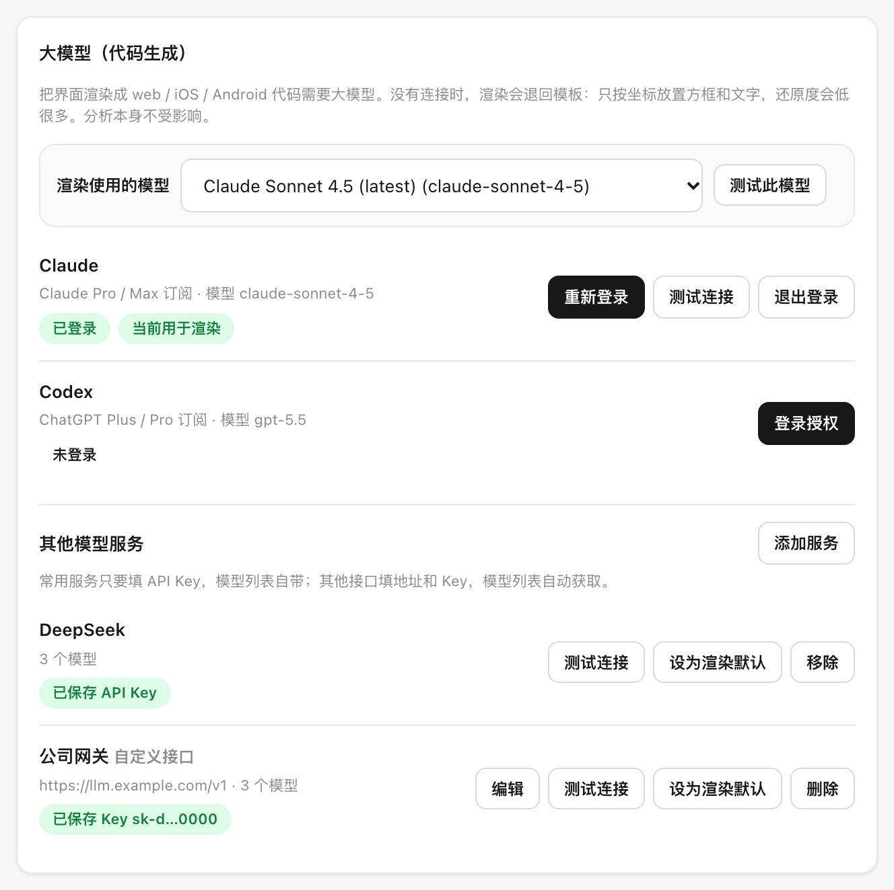
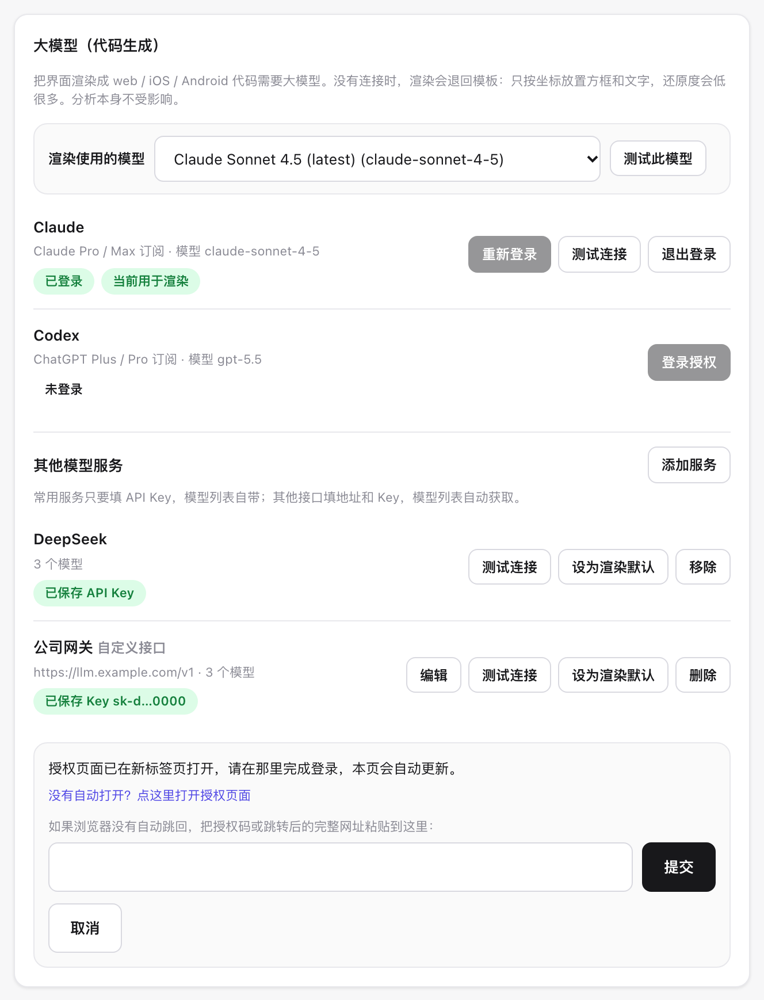
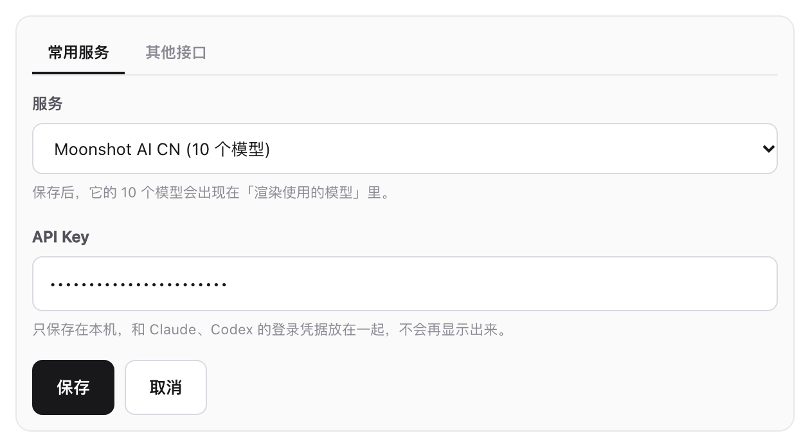
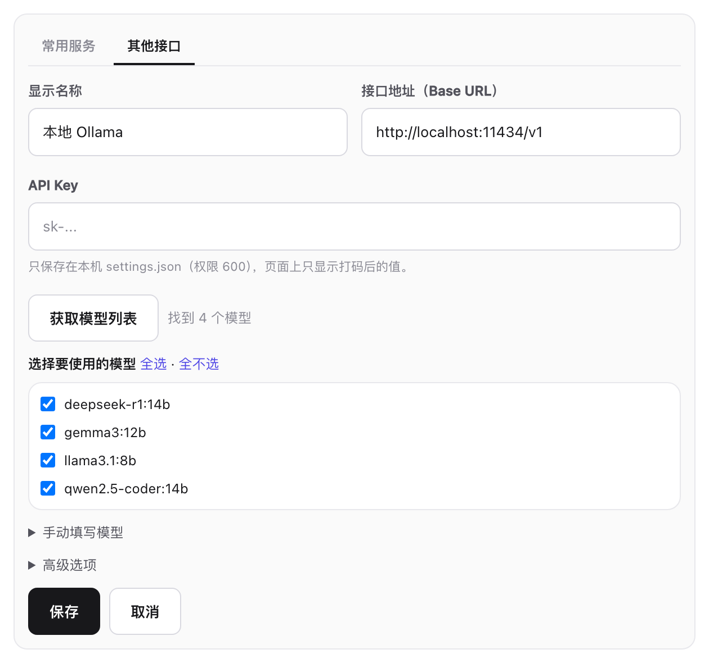
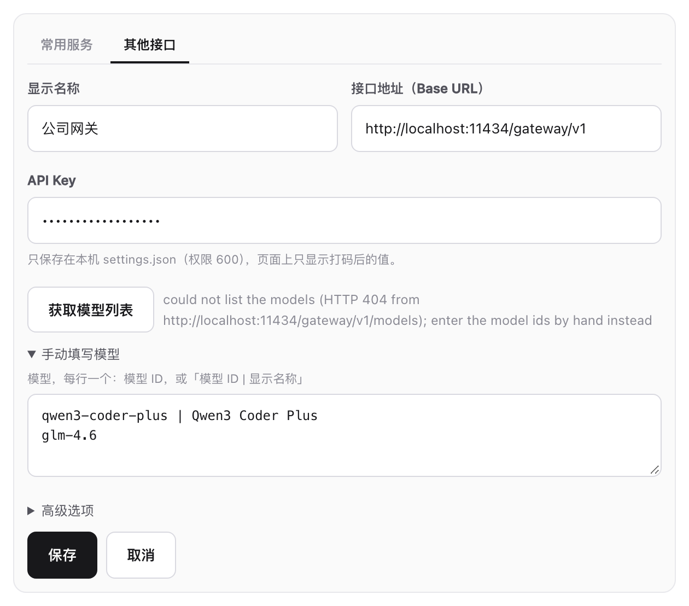

# 选择渲染使用的模型

[English](model-services.md) | 中文

分析 Figma 界面不需要大模型，但把界面**渲染**成 web、iOS、Android 代码需要：代码是由大模型写出来的。没有连接模型时，渲染会退回模板，只按坐标放置方框和文字，还原度会低很多。

一共有四种接入方式。接入之后，所有已连接服务的全部模型都可以随时切换：

| 接入方式 | 需要准备 | 能用的模型 |
|---|---|---|
| [订阅登录](#1-订阅登录) | Claude Pro/Max 或 ChatGPT Plus/Pro 账号 | Claude 或 Codex 的全部模型 |
| [常用服务](#2-常用服务只要填-api-key) | 只要 API Key | 这家服务自带的模型列表 |
| [其他接口](#3-其他接口填地址和-key) | 接口地址和 Key | 从接口自动获取 |
| [手动填写](#4-手动填写获取不到模型列表时) | 接口地址、Key 和模型 ID | 你填写的模型 |

以下操作都在网页界面的 **设置 → 大模型（代码生成）** 里完成（先运行 `dsh-figma-design-lens-cat serve`，再打开 <http://127.0.0.1:7420/settings>），每一步也都有对应的 CLI 命令。



从上到下依次是：渲染当前使用的模型、两个订阅、你添加的其他服务（图中是保存了 API Key 的 DeepSeek，和一个公司网关）。

---

## 1. 订阅登录

适用于 Claude（Claude Pro / Max）和 Codex（ChatGPT Plus / Pro）：

1. 点 Claude 或 Codex 旁边的 **登录授权**。
2. 新标签页会打开官方的授权页面，在那里点同意。
3. 浏览器会自动跳回本机，卡片随之更新为 **已登录 · 当前用于渲染**。



如果没有自动打开新标签页，点 **没有自动打开？点这里打开授权页面**。如果浏览器没能自动跳回（比如在另一台电脑上登录），把授权码或跳转后的完整网址粘贴到输入框里，点 **提交**。随时可以点 **取消** 中止登录。

```bash
dsh-figma-design-lens-cat llm login anthropic      # 或 openai-codex
```

## 2. 常用服务：只要填 API Key

内置了大约三十家服务，每家都自带模型列表：DeepSeek、Kimi（月之暗面）、通义 Qwen、智谱 Z.AI（GLM）、MiniMax、OpenAI、Gemini、OpenRouter、xAI、Groq、Mistral 等。

1. **其他模型服务 → 添加服务**，表单默认在 **常用服务** 标签页。
2. 选择服务，下方会提示它带了多少个模型。
3. 填入 API Key，点 **保存**。



保存后，渲染会自动切换到这家服务，默认用它的第一个稳定版模型。想用它的其他模型，在顶部 **渲染使用的模型** 里选就行。

```bash
dsh-figma-design-lens-cat llm services            # 列出所有服务及模型数量
dsh-figma-design-lens-cat llm login deepseek      # 提示输入 Key，输入时不显示
```

Key 只保存在本机，和订阅的登录凭据放在一起，之后不会再显示出来。

## 3. 其他接口：填地址和 Key

公司网关、自己部署的模型、本地的 Ollama 或 LM Studio 都可以，只要它像 OpenAI 兼容服务那样，在 `<地址>/models` 提供模型列表。

1. **添加服务 → 其他接口**。
2. 填写显示名称、接口地址（通常以 `/v1` 结尾）和 API Key。本地服务一般不需要 Key。
3. 点 **获取模型列表**，接口提供的所有模型会列出来，默认全部勾选。
4. 取消不需要的模型，点 **保存**。



ID 会根据名称或接口地址自动生成。其余设置都收在 **高级选项** 里，一般不用改：协议（默认 `openai-completions`，也支持 `openai-responses` 和 `anthropic-messages`）、ID，以及用环境变量提供 Key（这样配置里不保存密钥）。

```bash
dsh-figma-design-lens-cat llm provider add gateway --name "公司网关" \
  --base-url https://gateway.example.com/v1 --api-key-env GATEWAY_API_KEY
# -> found 12 models at https://gateway.example.com/v1/models
```

## 4. 手动填写：获取不到模型列表时

有些接口不提供模型列表。这时点 **获取模型列表** 会显示失败原因，并自动展开 **手动填写模型**。每行填一个模型：只写模型 ID，或写成 `模型 ID | 显示名称`。



```bash
dsh-figma-design-lens-cat llm provider add gateway --base-url https://gateway.example.com/v1 \
  --api-key-env GATEWAY_API_KEY --model qwen3-coder-plus="Qwen3 Coder Plus" --model glm-4.6
```

---

## 切换模型

卡片顶部的 **渲染使用的模型** 按服务分组，列出所有已连接服务的全部模型，选中后立即生效。**测试此模型** 会给它发一个简短的请求，确认能用。未登录的订阅会显示登录后可以多出多少个模型。

```bash
dsh-figma-design-lens-cat llm models                          # 按服务分组列出全部模型，* 表示正在使用的
dsh-figma-design-lens-cat llm use deepseek/deepseek-v4-pro    # 切换
dsh-figma-design-lens-cat llm test                            # 给当前模型发一个测试请求
```

## 管理已添加的服务

每个已添加的服务都有自己的按钮：

| 按钮 | 作用 |
|---|---|
| **测试连接** | 给这个服务发一个请求 |
| **设为渲染默认** | 让渲染使用这个服务，沿用之前为它选过的模型 |
| **编辑**（其他接口） | 修改地址、Key 或模型；Key 留空表示不修改 |
| **移除** / **删除** | 删掉这个服务和保存的 Key |

```bash
dsh-figma-design-lens-cat llm status                 # 哪些服务可用，渲染当前用的是哪个
dsh-figma-design-lens-cat llm logout deepseek        # 删除服务的 Key，或退出订阅登录
dsh-figma-design-lens-cat llm provider list          # 已添加的接口，Key 打码显示
dsh-figma-design-lens-cat llm provider remove gateway
```

## 密钥与隐私

- Key 只保存在本机：订阅登录和常用服务的 Key 在 `~/.dsh-figma-design-lens-cat/auth.json`，其他接口的 Key 在 `settings.json`，两个文件的权限都是 600。
- 网页界面不会把 Key 返回给浏览器，只显示打码后的样子，比如 `sk-d…0000`。
- 登录、保存 Key、获取模型列表这些操作，只接受来自本机的请求。
- 如果完全不想保存 Key，可以在 **高级选项** 里填一个环境变量名（CLI 用 `--api-key-env`）。这个环境变量要在运行渲染的进程里能读到：如果 `serve` 是由后台服务启动的，它读不到你 shell 里设置的变量，这种情况下直接保存 Key 更省事。

## 常见问题

**渲染出来还是只有方框和文字。** 没用上大模型的渲染会在页面上提示「本次用模板渲染，没有使用大模型」，并写明原因。可以看 **设置 → 环境检查**，或运行 `dsh-figma-design-lens-cat doctor`。

**获取模型列表时报 401 或 403。** Key 不对，或者这个 Key 没有权限。

**获取模型列表时报 404。** 接口不提供模型列表，或者地址少了 `/v1`。改用手动填写模型即可。

**服务默认的模型不是我想要的。** 默认会选列表里的第一个稳定版模型，在 **渲染使用的模型** 里换成你想要的就行。
